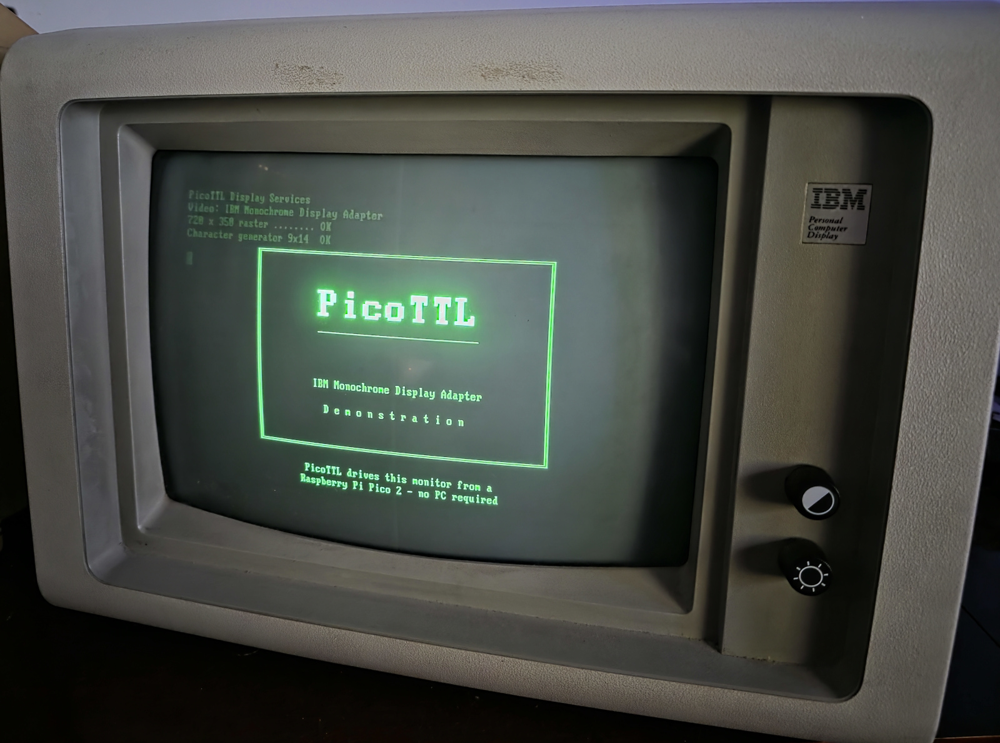
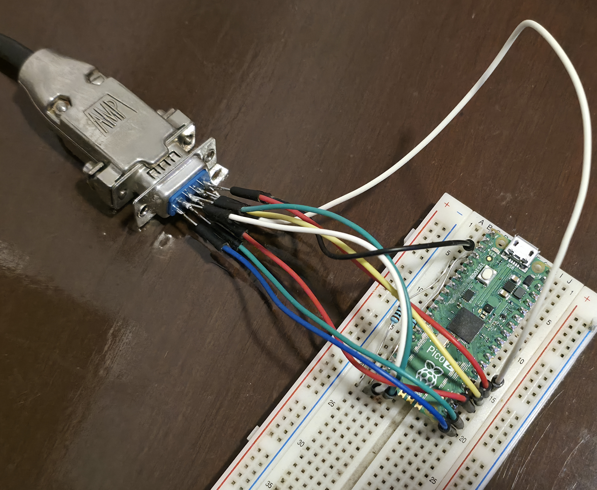
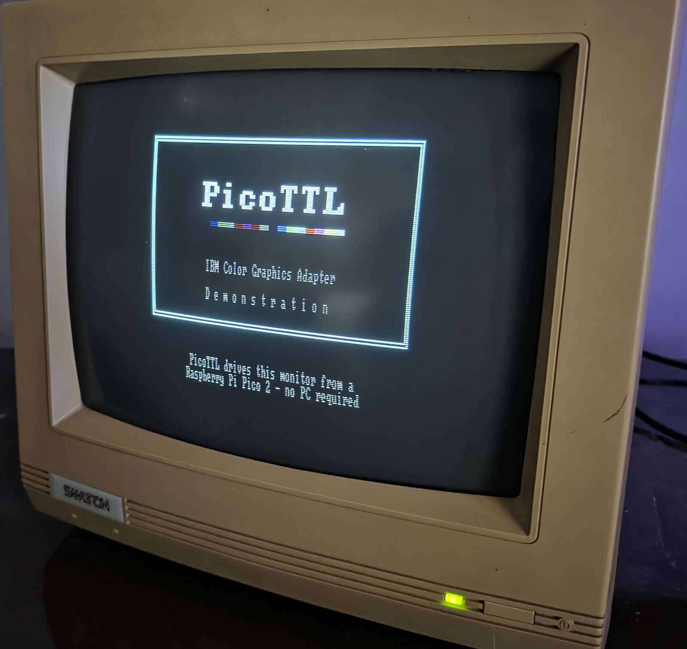
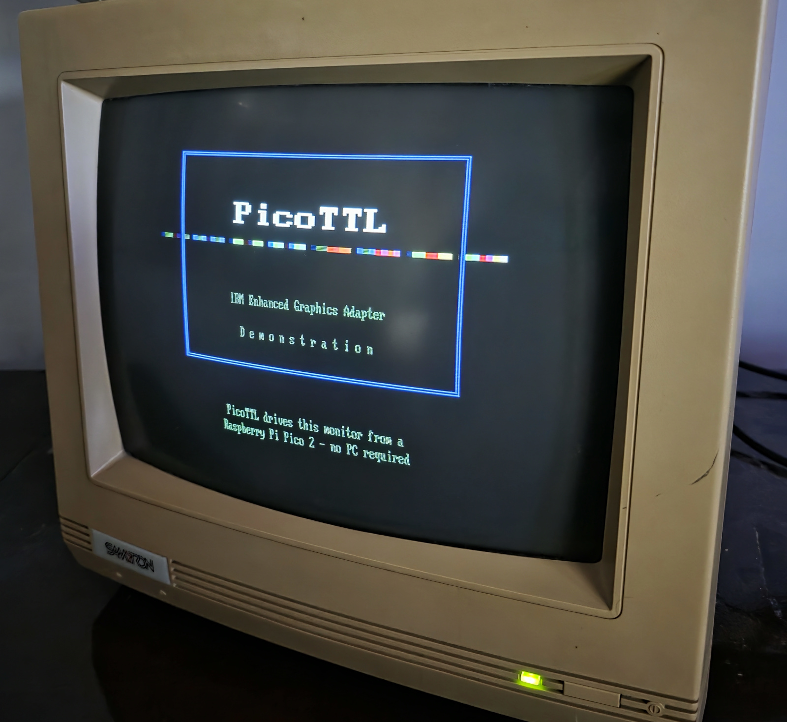

# PicoTTL

[](https://github.com/jesus966/PicoTTL/actions/workflows/ci.yml)
[](https://github.com/jesus966/PicoTTL/releases)
[](LICENSE)
[](https://github.com/jesus966/PicoTTL/releases/latest)

TTL video framework for the Raspberry Pi Pico 2 (RP2350). PicoTTL
generates genuine IBM MDA, CGA and EGA video signals in hardware - PIO
and DMA scan out every line with **zero CPU involvement** - and drives
real period monitors through a handful of GPIOs and series resistors.



```
Application code                     Signals on the DE-9
----------------------------------  -------------------------------
Display display(device);            HSYNC / VSYNC, TTL levels
display.begin(VideoMode::IbmMda);   720x350 @ 50 Hz (18.43 kHz)
text.print("Hello, 1981");          pixel-exact 9x14 IBM glyphs
```

## Goals

- Drive **original IBM monitors** (MDA 5151, CGA 5153-class, EGA 5154)
  with historically exact timings, character sets and colors.
- A **stable, frozen public API**: application code written today keeps
  compiling against every future version (see
  [docs/api_evolution.md](docs/api_evolution.md)).
- **Zero CPU on the signal path**: after `begin()`, scanout is entirely
  PIO + DMA; the CPU only draws into the framebuffer.
- Platform independence above the backend boundary: the same
  `Graphics`/`Text`/`Terminal` code runs on MDA, CGA, EGA and a host
  (desktop) backend used for automated regression testing.

## Supported standards

| Standard | Modes | Format | Status |
|---|---|---|---|
| IBM MDA | 720×350 @ 50 Hz | Mono1 / Packed2 (video + intensity) | Hardware-validated on an IBM 5151 |
| IBM CGA | 640×200, 320×200 @ 60 Hz | Mono1 / Packed2 / Packed4 (RGBI) | Hardware-validated on a Samtron SC-431E |
| IBM EGA | 640×350 @ 60 Hz (+ CGA-compatible 200-line modes) | up to Packed8 (6-wire rgbRGB, 64 colors) | Hardware-validated |
| Host | all of the above | all formats | In-memory backend for the automated test suite |

Supported hardware: **Raspberry Pi Pico 2 (RP2350)**, Pico SDK 2.3.0,
C++17, no external libraries. The architecture is explicitly designed
for future backends (other platforms, other display families) - see
[docs/architecture.md](docs/architecture.md), section 10.

## Design philosophy

The project is governed by written principles
([docs/design_principles.md](docs/design_principles.md)); the ones you
will notice first:

- **Public API stability has priority over implementation
  convenience.** The API grows additively; existing signatures never
  change. Every example must compile unmodified after every change.
- **Design first.** Architecture is reviewed and documented before
  code is written.
- **Historical authenticity.** Timings come from IBM's 6845 tables;
  fonts are generated from IBM character ROM dumps; CGA color 6 is
  brown for the same reason it was in 1981.
- **Hardware validation.** Every feature ships with an example that
  was verified on a real CRT before the feature is considered done.
- **No hidden machinery**: no heap allocations, no exceptions, no
  interrupts taken by the framework, no implicit hardware claims. The
  application owns every buffer and every hardware resource listed in
  a backend `Config`.

## Architecture summary

```
Application
  Terminal / AnsiTerminal      cell buffer, cursor, blink, ANSI parsing
  Text                         byte -> glyph rendering, code pages
  Graphics                     lines, rects, bitmaps, clipping
  DisplaySurface / Framebuffer pixel access, packed formats (1/2/4/6/8 bpp)
  Display + DisplayDevice      the portability boundary
    rp2350::MdaDisplayDevice   |
    rp2350::CgaDisplayDevice   |  PIO + DMA scanline engines
    rp2350::EgaDisplayDevice   |
    host::HostDisplayDevice    in-memory scanout for tests
```

Everything above `DisplayDevice` is platform-independent and identical
across backends. The full reference is
[docs/architecture.md](docs/architecture.md).

## Current status

Fully implemented and **validated end to end on real hardware** (IBM
5151, Samtron SC-431E CGA, EGA monitor), including the reference
connector wiring, all examples, the three showcase demonstrations and
the three diagnostics applications. There are no known functional
issues.

- Three IBM standards implemented and validated on real monitors.
- 45 numbered examples (each validates exactly one feature), 3
  showcase demonstrations, 3 CRT diagnostics applications.
- 56 automated host tests (no hardware required).
- IBM code pages 437 (default) and 850, generated from authentic ROM
  and CPI font data.
- One canonical wiring (the EGA-superset **reference connector**) for
  all monitors.

## Quick start

Prerequisites: [Pico SDK](https://github.com/raspberrypi/pico-sdk)
2.3.0 (the VS Code Raspberry Pi Pico extension installs everything),
CMake ≥ 3.13, Ninja, ARM GCC.

```sh
git clone https://github.com/jesus966/PicoTTL.git
cd PicoTTL
# PICO_SDK_PATH must point at a Pico SDK 2.3.0 checkout (the VS Code
# Pico extension configures this automatically).
cmake -S . -B build -G Ninja
cmake --build build
```

Every example produces a UF2 under `build/examples/` when built locally.
Precompiled UF2 packages for the latest release are available from the
[GitHub Releases](https://github.com/jesus966/PicoTTL/releases) page.

To flash a locally built example, hold BOOTSEL, plug in the Pico 2, and copy e.g.
`build/examples/17_hello_world/picottl_example_17_hello_world.uf2`
onto the mass-storage device.

Run the automated test suite on your PC (no Pico needed):

```sh
cmake -S tests -B build-host -G Ninja
cmake --build build-host
./build-host/picottl_tests
```

## Using PicoTTL in your project

After initializing the Pico SDK in your application's CMake project, add
PicoTTL as a subdirectory and link its public target:

```cmake
add_subdirectory(external/PicoTTL)
target_link_libraries(my_app PRIVATE picottl)
```

This adds the library without building PicoTTL's examples or diagnostics.
See [docs/integration.md](docs/integration.md) for a complete minimal project
and submodule, vendored-copy and FetchContent integration.

## Wiring

PicoTTL's canonical physical interface is the IBM EGA DE-9 connector -
IBM's own universal adapter, which drove MDA, CGA and EGA monitors
from one socket. One wiring serves every monitor:

| GPIO | DE-9 pin | MDA | CGA | EGA |
|------|----------|-----|-----|-----|
| 2  | 8 | HSYNC | HSYNC | HSYNC |
| 3  | 9 | VSYNC | VSYNC | VSYNC |
| 16 | 5 | - | Blue | Primary Blue |
| 17 | 4 | - | Green | Primary Green |
| 18 | 3 | - | Red | Primary Red |
| 19 | 7 | VIDEO | (reserved) | Secondary Blue |
| 20 | 6 | INTENSITY | Intensity | Secondary Green |
| 21 | 2 | - | - | Secondary Red |
| GND | 1 | GND | GND | GND |

Use **470 Ω series resistors only on HSYNC and VSYNC**. Connect the
remaining monitor signal wires directly. Ground goes to DE-9 pin 1 only:
on the EGA reference connector, DE-9 pin 2 is a signal (Secondary Red),
while MDA/CGA monitors ground that pin internally. Full rules and rationale:
[docs/architecture.md](docs/architecture.md), section 15. GPIO 4 is an
internal handshake - never wire it to the monitor.

### TTL voltage levels

The monitor inputs are specified as +5 V TTL, but the +3.3 V GPIO levels
from the Raspberry Pi Pico are detected reliably by the monitors used with
PicoTTL. For a more serious or production-oriented project, the ideal
solution is to add buffers or level translators that raise the Pico's
3.3 V signals to +5 V before they reach the monitor.

> **CRT safety**: these monitors have no protection against wrong scan
> rates. Never feed 350-line timings to a 15.7 kHz CGA monitor or vice
> versa.



## Examples

Each example validates one feature and documents expected output,
wiring and known regressions in its header.

| Range | Backend | Topics |
|---|---|---|
| 01–15 | MDA | sync, pixel path, graphics primitives, bitmaps, stress/regression patterns |
| 16–24 | MDA | fonts, text, attributes, scrolling, Terminal, ANSI serial terminal |
| 25–33 | CGA | sync, 16 RGBI colors, 320/640 modes, graphics, text, terminals |
| 34–42 | EGA | sync, 64 colors, CGA-compatible modes, graphics, text, terminals |
| 43 | multi | host image display over USB CDC (PC -> monitor, Python host) |
| 44 | MDA | IBM code pages: CP437 vs CP850 |
| 45 | MDA | Matrix rain tuned for medium/high-persistence phosphor monitors |
| 96–98 | MDA/CGA/EGA | official showcase demonstrations |

Diagnostics: `diagnostics/` (MDA) and `apps/{cga,ega}_crt_diagnostics/`
are pattern suites for testing and adjusting real CRTs.

### Showcase demonstrations

#### Demo 96: MDA


#### Demo 97: CGA



#### Demo 98: EGA



## Documentation map

| Document | Contents |
|---|---|
| [docs/architecture.md](docs/architecture.md) | layers, abstractions, policies, backends, diagnostics, showcase demos, code pages, reference connector |
| [docs/design_principles.md](docs/design_principles.md) | the project's written philosophy (21 principles) |
| [docs/api_evolution.md](docs/api_evolution.md) | what "frozen" means; additive-evolution rules |
| [docs/public_release_checklist.md](docs/public_release_checklist.md) | release process checklists |
| Example headers | per-feature contracts: validates / expected / regressions |

## Roadmap

- **PicoTTL Stream** (separate project): host->Pico video streaming
  over USB CDC with a frozen datagram protocol; specification complete,
  implementation in progress.
- Overscan and non-IBM raster variants (the engine already accepts
  arbitrary timings; `VideoMode` is a curated catalog, not a limit).
- Additional display families (e.g. Amstrad monitors) as new backends.
  (Hercules is deliberately NOT on this list: PicoTTL's MDA backend is
  already pixel-addressable at 720×350 on the same monitor, a strict
  superset of Hercules graphics; exact 720×348 raster timing, if ever
  wanted, would be an additive `VideoMode` on the MDA backend.)
- Additional code pages (CP852, CP858) - structurally additive.

## Contributing

See [CONTRIBUTING.md](CONTRIBUTING.md). In short: design review before
code, documentation with the change, additive API evolution only, and
hardware validation on a real monitor for anything that touches the
signal path.

## License

MIT - see [LICENSE](LICENSE).

Font data provenance: the CP437 glyph data is generated from IBM
character ROM dumps (via
[spacerace/romfont](https://github.com/spacerace/romfont)); the CP850
glyph data comes from IBM PC-DOS 2000 codepage files (via
[viler-int10h/vga-text-mode-fonts](https://github.com/viler-int10h/vga-text-mode-fonts)).
The provenance of this historical compatibility data, and the
good-faith basis on which the project includes it, are documented in
[THIRD_PARTY_LICENSES.md](THIRD_PARTY_LICENSES.md); the generator
scripts live in `tools/`.
